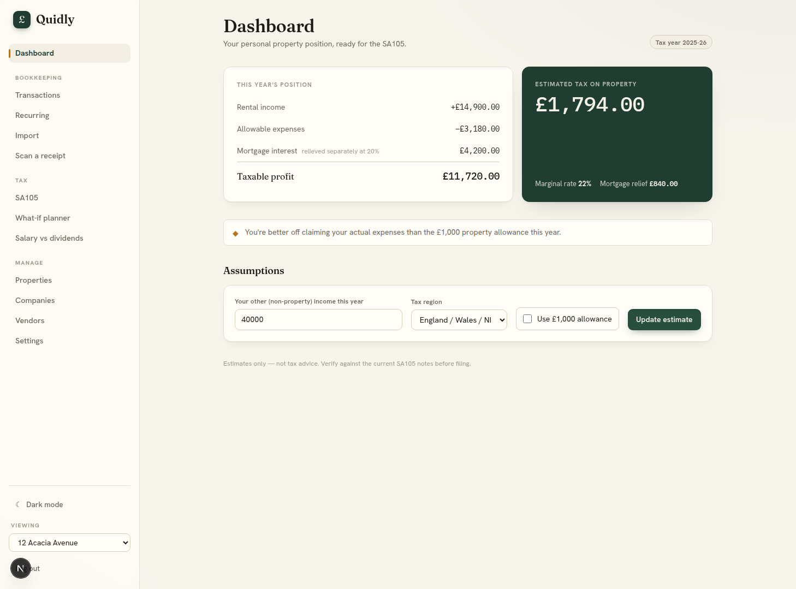
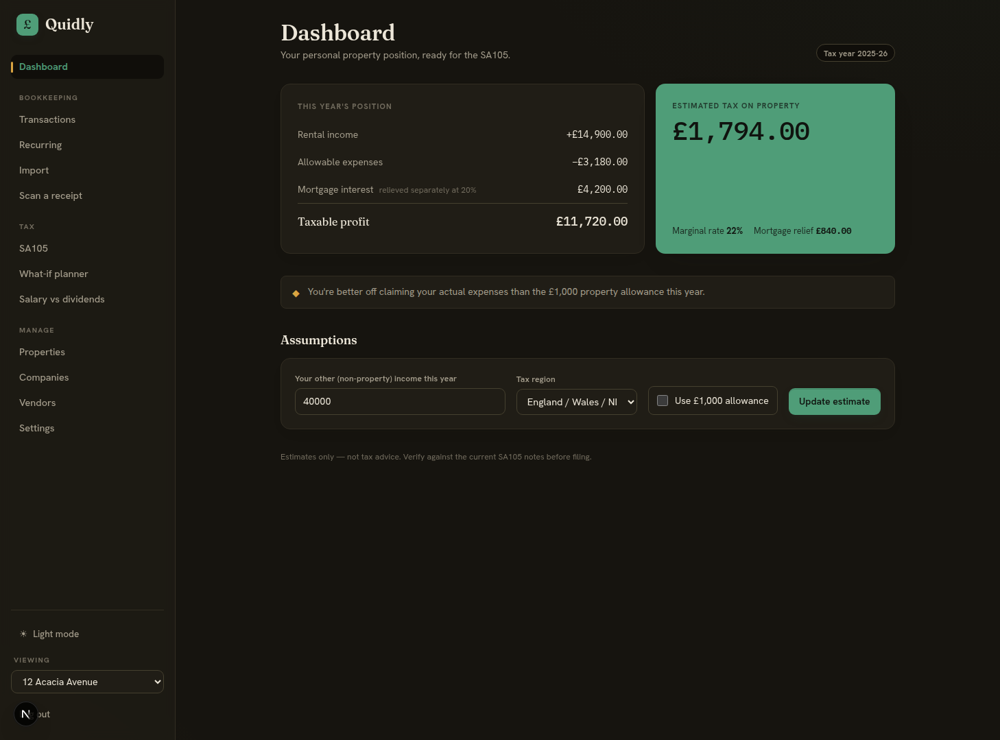
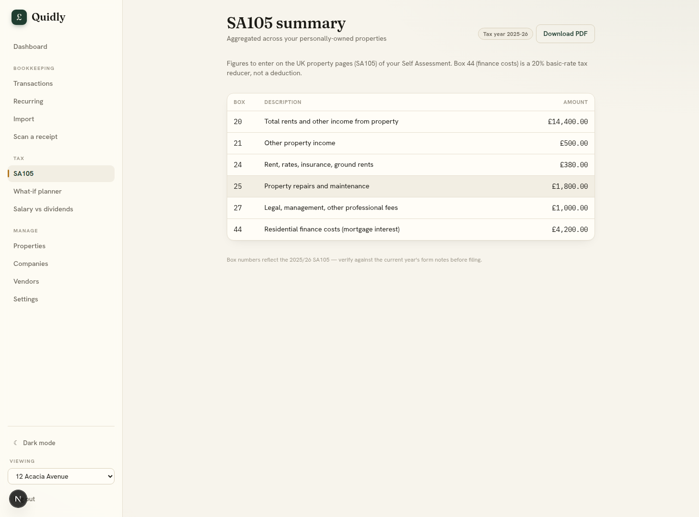
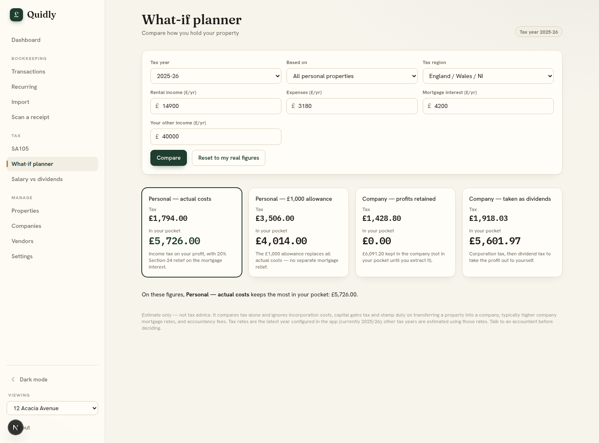

# Quidly

**Self-Assessment, sorted.** — free, self-hosted UK-landlord bookkeeping and tax.


Quidly is a self-hosted bookkeeping app built for UK landlords: track rent and expenses across your properties, then turn them into an SA105 you can file. Run it on your own box, keep your own data.

## Screenshots

| Light | Dark |
| --- | --- |
|  |  |





## What it is

Quidly is free and self-hosted, with a UK-first design. **Money is stored as integer pence end-to-end** — there is no floating-point arithmetic in the money path, so nothing drifts or rounds unexpectedly. Each install is **single-user**. Quidly is **not affiliated with HMRC**; it produces estimates, not tax advice.

## Features

- **Bookkeeping** — transactions, recurring rules, one-click bank-CSV import, multi-property.
- **Receipt scanning** — optional AI extraction using your own Anthropic key.
- **SA105 & personal tax** — £1,000 property allowance, Section 24 finance-cost reducer, Scottish bands, and SA105 PDF export.
- **Limited companies** — corporation tax (including marginal relief), dividends, director's loan s455 + benefit-in-kind.
- **Plan ahead** — a what-if planner plus a salary-vs-dividend optimiser.
- **Light & dark themes.**

## Self-host with Docker (recommended)

```bash
git clone https://github.com/WarlaxZ/quidly.git && cd quidly
cp .env.example .env                                    # then set SESSION_SECRET
docker compose run --rm quidly npm run set-password     # paste the Docker-Compose hash into .env
docker compose up -d                                    # open http://localhost:3000
```

**Password hash & the `$` gotcha.** Docker Compose interpolates bare `$` in `env_file` values as variable references and strips them. Put the argon2 hash in `.env` with **each `$` doubled** (`$$`). `set-password` prints exactly that "Docker-Compose" form for you — it prints three forms in total: the dev backslash-escaped form, the Docker-Compose doubled form, and the raw unescaped hash. Use the Docker-Compose one here.

**Data persists** in the `quidly-data` Docker volume — the SQLite database and uploads both live under `/data`, so they survive restarts and upgrades.

**`COOKIE_SECURE`.** Leave it unset (the secure default) when serving behind HTTPS. Set `COOKIE_SECURE=false` **only** if you serve plain HTTP on a trusted LAN, otherwise login cookies won't be sent.

## HTTPS reverse proxy (Caddy)

```caddyfile
quidly.example.com {
    reverse_proxy localhost:3000
}
```

Caddy auto-provisions and renews TLS certificates for you. Behind HTTPS, leave `COOKIE_SECURE` unset. Traefik and nginx work equally well — just point the proxy at `localhost:3000`.

## Local development

```bash
npm install
npm run set-password            # paste the DEV (backslash-escaped) hash into .env
# .env also needs SESSION_SECRET=... (openssl rand -base64 32) and DATABASE_URL="file:./dev.db"
npx prisma migrate deploy       # apply migrations (Prisma v7: hand-authored SQL)
npx prisma db seed              # seed HMRC categories
npm run dev                     # http://localhost:3000
npm test                        # 198 tests
```

Prisma v7 note: the datasource URL is configured in `prisma.config.ts` (read from `DATABASE_URL`), and migrations are hand-authored SQL applied with `migrate deploy` — **not** `migrate dev`.

## Migrating from Akaunting

Import your existing Akaunting data (transactions, vendors, categories) into Quidly.

**Prerequisites:** Docker (for the analyse step) and a MySQL/MariaDB dump of your Akaunting database (`.sql`).

```bash
# 1. Analyse the dump — loads it into a throwaway MariaDB and writes a review pack
npm run migrate:akaunting:analyse -- ./akaunting-migration/dump.sql

# 2. Review akaunting-migration/report.md (incl. "what's missing") and edit
#    akaunting-migration/mapping.json — set a "target" for any unmapped category.

# 3. Dry-run (writes nothing), then apply for real
npm run migrate:akaunting:apply -- --dry-run
npm run migrate:akaunting:apply

# Optional: also copy receipt files from Akaunting's storage folder
npm run migrate:akaunting:apply -- --attachments-dir /path/to/akaunting/storage
```

Each Akaunting *company* becomes a Quidly *property*. Amounts are treated as GBP; non-GBP transactions are listed and skipped. The import is idempotent — re-running is safe and never duplicates (imported rows are tagged with an `externalRef`). Files under `akaunting-migration/` are git-ignored as they may contain financial data.

## Configuration

`.env.example` is the annotated source of truth; the table below summarises it.

| Variable | Required | Description |
| --- | --- | --- |
| `AUTH_USERNAME` | Yes | Login username. Generated together with the hash by `npm run set-password`. |
| `AUTH_PASSWORD_HASH` | Yes | argon2id password hash. Use the form matching your setup (dev / Docker-Compose / raw). |
| `SESSION_SECRET` | Yes | Long random secret (32+ chars), e.g. `openssl rand -base64 32`. |
| `DATABASE_URL` | Set by Docker | SQLite connection string. Dev default `file:./dev.db`; Docker sets `file:/data/quidly.db`. |
| `UPLOAD_DIR` | Set by Docker | Upload directory. Dev default `./uploads`; Docker sets `/data/uploads`. |
| `COOKIE_SECURE` | Optional | Set to `false` only for plain-HTTP on a trusted LAN. Leave unset behind HTTPS. |
| `ANTHROPIC_API_KEY` | Optional | Enables AI receipt scanning, using your own Anthropic key. |
| `EXTRACTION_MODEL` | Optional | Vision model for receipt extraction. Defaults to a cheap vision-capable Claude model. |

## Tech stack

Next.js 16 (App Router) · Prisma v7 + SQLite (better-sqlite3 adapter) · Tailwind v4 · iron-session + argon2id · Vitest · Docker.

## Tax accuracy & caveats

Quidly produces **estimates, not advice** — verify HMRC rates each April against the official guidance. It is currently configured for the **2025-26** tax year; other years fall back to 2025-26 with an in-app notice. Each install is single-tenant.

## Licence

Licensed under [AGPL-3.0](LICENSE). Quidly is open, but the AGPL means that if you run a modified version as a network service, you must share your changes with its users. Commercial or hosted licensing from the author is possible if the AGPL doesn't fit your use.
